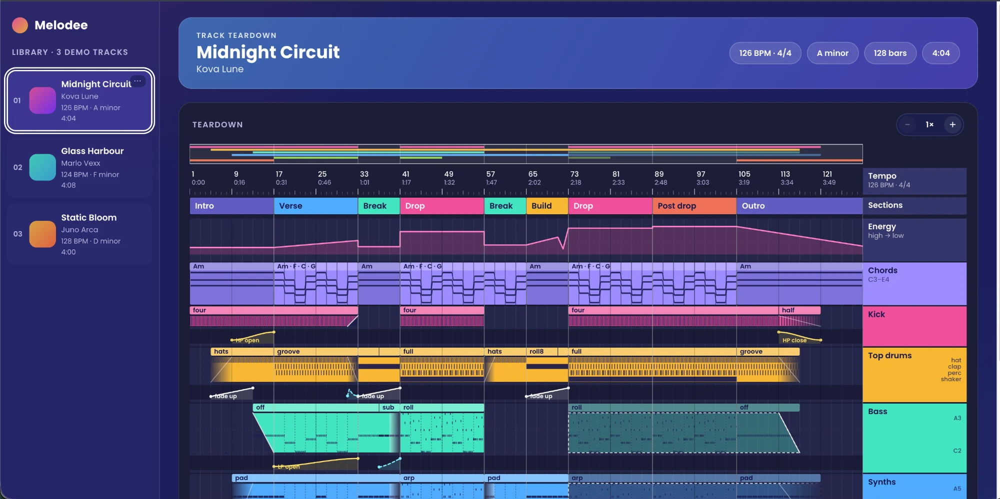

# 🎛️ Melodee — Track Teardown

A clickable demo of the arrangement "whiteboard" view: sections, energy, chords, and one lane per
element, with filter sweeps, volume, and spatial movement drawn right inside each lane. All analysis
is hand-authored mock JSON — no audio analysis, no backend, just the UI.

> *"Where does the bass drop out?"* · *"What's the chord progression in the build?"* · *"Which lane has the filter sweep?"*



## Features

- **Full-track breakdown.** Sections, energy curve, chord progression, and per-instrument lanes, all
  drawn from bar-accurate mock data.
- **Real note and hit patterns.** Drum lanes show on/off hits per 16th note; melodic lanes show the
  actual note progression, resolved against the chord playing at each bar.
- **Movement and shifts.** Filter sweeps, volume fades, and reverb/delay throws are drawn as curves
  inside each lane, so the moments a sound opens up or pulls back are visible at a glance.
- **Zoomable timeline.** A tempo ruler and pixel-per-bar zoom keep long arrangements readable.

## How it works

```
Mock track JSON ──► validator (rejects bad fields) ──► timeline renderer (sections/energy/chords/lanes)
```

| Path | Role |
|---|---|
| `src/types/track.ts` | The data model: sections, energy, harmony, elements, patterns, movements |
| `src/lib/validate.ts` | Rejects malformed track JSON with the path of the bad field |
| `src/components/Timeline.tsx` | The main teardown view: ruler, sections, energy, chords, lanes |
| `src/components/ElementLane.tsx` | One lane: clips, notes/hits, movement curves, chord marks |
| `public/tracks/*.json` | Mock tracks, listed in `public/tracks/index.json` |

## Getting started

```bash
npm install --legacy-peer-deps
npm run dev      # http://localhost:5173, add #demo-02 / #demo-03 to open another track
npx vitest run   # geometry, validator, and every mock track checked against the data model
```

Each track is one JSON file in `public/tracks/`, listed in `public/tracks/index.json`. Positions are bars,
1-indexed, `endBar` inclusive. Swap a file or add an id to the index and the view changes with no code
change. Additions to the spec's data model, all optional:
- `harmony.barsPerChord` (default 2).
- `elements[].patterns`: reusable drum-hit patterns (`voices` mapped to 16th-note steps) and note patterns
  written as chord tones (`r 3 5 7 8`). `blocks[].pattern` picks one and `blocks[].overrides` swaps it for
  a bar range (fills, rolls). A block with no pattern falls back to a plain presence bar.

## Status

Phase 1 of 3: mock data and the timeline renderer. Library click-to-load and timeline zoom are in as
review aids. Next: Phase 2 (drag and drop, analyzing state, fake-door modal), Phase 3 (playback, tooltips,
dimension filter, zoom). Design reference: `design/reference.png`.

The real-pipeline build (genuine Demucs / DrumSep / Basic Pitch analysis, real playback and sound-swap)
lives on `main`, and is also saved at the `v1-real-pipeline` tag.

## Tech stack

React · TypeScript · Vite · SVG
